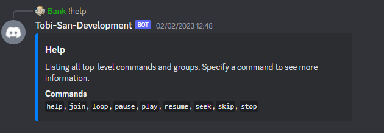
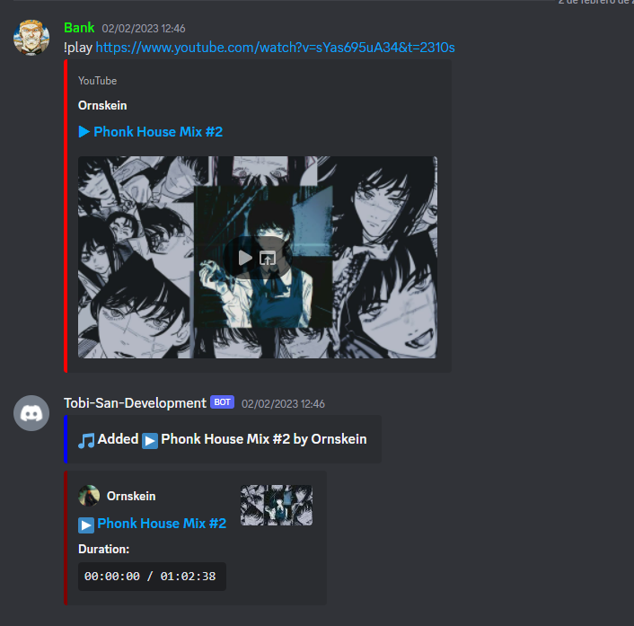
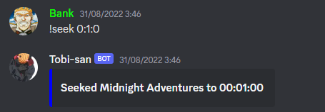
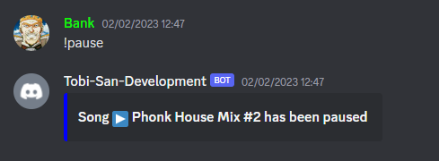
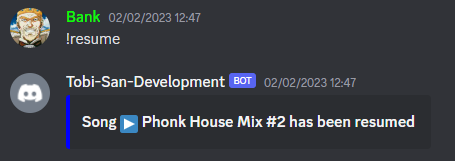
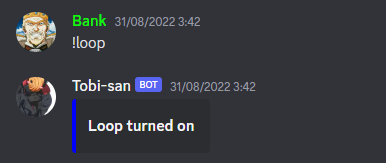
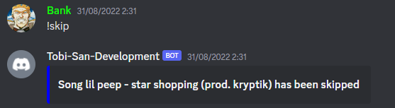

<h1 align="center">
  <br>
  
  <br>
  Tobi
  <br>
</h1>

<p align="center"> 
Tobi is a discord music bot that uses low memory and cpu usage.
</p>

<center>
  <a href="https://hub.docker.com/repository/docker/xbank/tobi-bot"></a>
  <a href="https://github.com/xBaank/Tobi/actions"></a>
</center>


## Comands
- help
- loop
- pause
- play
- resume
- seek
- skip
- stop
- join

## Screenshots








## Key Features
- Low memory usage
- Low cpu usage
- Fully async
- Low loading time

## Sources
| Sources  | State |
| ------------- | --- |
| Youtube  | DONE |
| Spotify  | TODO |
| SoundCloud  | TODO |

## Enviroment variables
| Variables  | Required |
| ------------- | --------- |
| Token  | &#9745; |
| Prefix  | &#9745; |
| Sapisid  | &#9744; |
| Psid  | &#9744; |
| PacketQueueSize  |  &#9744; |

> **Warning**
> `Sapisid` and `Psid` are youtube cookies required to make authenticated requests to `www.youtube.com`. If you don't provide them you will not be able to play restricted videos.

## How to get Sapisid and Psid to access restricted videos
1. Go to [https://www.youtube.com](https://www.youtube.com)
2. Login with an account
3. Open the developer tools (F12)
4. Go to the `Storage` tab
5. Go to `Cookies` and copy the `SAPISID` and `__Secure-1PSID` values

## Docker
There is a docker image to self host.

To run it use 
```bash
docker run -d -e Token=PutHereYourToken -e Sapisid=Value -e Psid=Value -e Prefix=! xbank/tobi-bot:latest
```

## Credits
- DsharpPlus - Thanks to [DsharpPlus](https://github.com/DSharpPlus/DSharpPlus), This project uses a [Fork](https://github.com/xBaank/DSharpPlus/tree/v4.2.1-tobi).
- YoutubeExplode - Thanks to [YoutubeExplode](https://github.com/Tyrrrz/YoutubeExplode), This project uses a [Fork](https://github.com/xBaank/YoutubeExplode/tree/tobi).